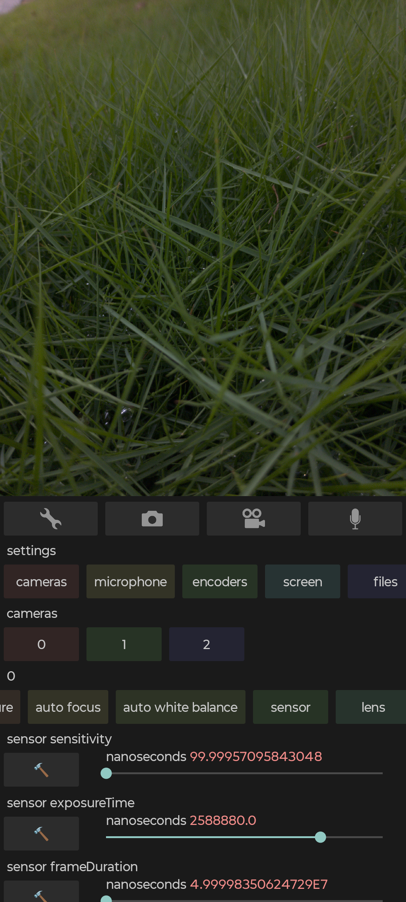

# camataca
with this camera app you can control nearly everything that android allows  
it supports HDR, RAW, dng, avif, jxl  
it shows all video and audio encoders that already come in your phone  
the camera weights 1MB but avif and jxl codecs increase the size to 45MB  

the app is installed using APK file  
https://github.com/Particlo/camataca/raw/refs/heads/main/camataca.apk  
search for "how to install an APK file" if you dont know about APK

